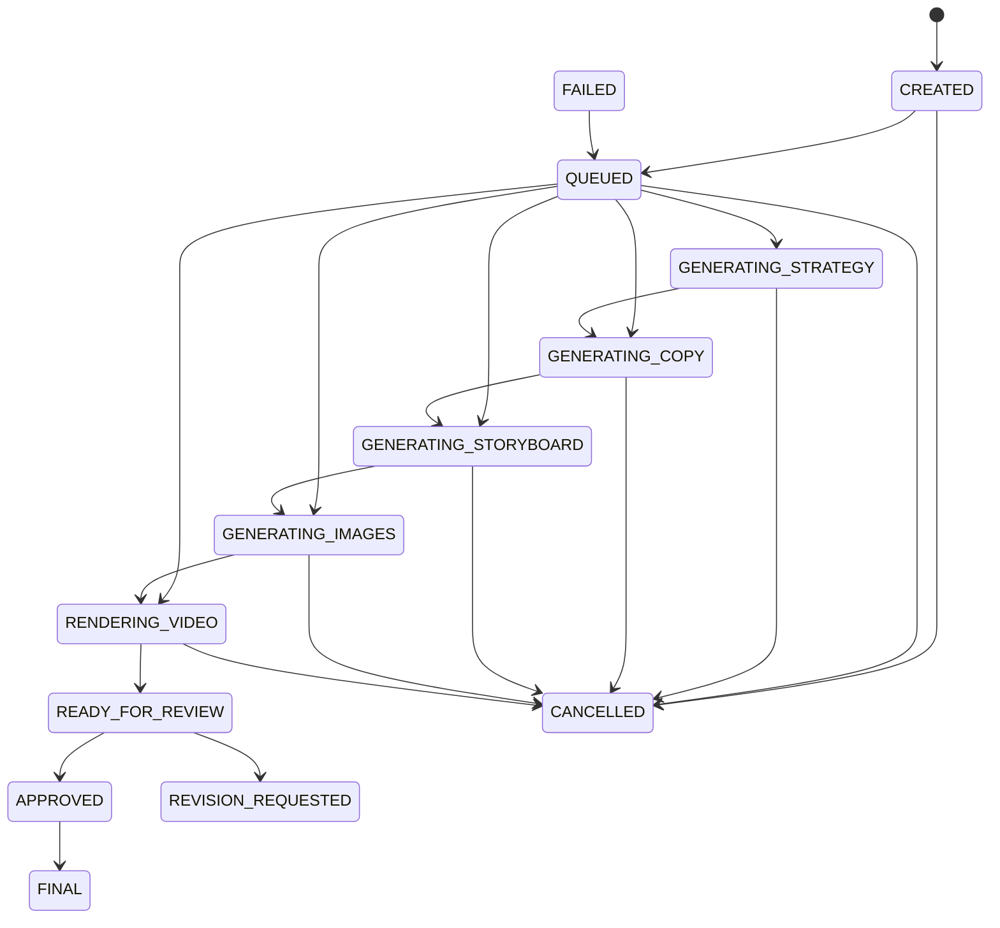

# Campaign Lifecycle Contract

This document is normative for campaign-version status, transition ownership, progress, and events. Unknown states and transitions not listed here are rejected.

## Status Vocabulary

| Status | Kind | Meaning |
|---|---|---|
| `CREATED` | Non-terminal | Version record exists; no durable job is confirmed. |
| `QUEUED` | Non-terminal | A durable SQS command exists or is being redelivered. |
| `GENERATING_STRATEGY` | Non-terminal | Strategy generation is active. |
| `GENERATING_COPY` | Non-terminal | Marketing copy generation is active. |
| `GENERATING_STORYBOARD` | Non-terminal | Storyboard, scene timing, prompts, and narration planning are active. |
| `GENERATING_IMAGES` | Non-terminal | Image generation/validation is active. |
| `RENDERING_VIDEO` | Non-terminal | Composition, render polling, validation, and S3 transfer are active. |
| `READY_FOR_REVIEW` | Non-terminal, durable pause | All review artifacts are valid and await user action. |
| `REVISION_REQUESTED` | Terminal for the reviewed version | Feedback is frozen; processing continues only in a new child version. |
| `APPROVED` | Non-terminal, durable handoff | User approved this exact version; final package assembly is pending. |
| `FINAL` | Terminal | Approved package is valid and available. |
| `FAILED` | Terminal until explicit retry | Durable sanitized failure is recorded. |
| `CANCELLED` | Terminal | User cancellation is durable; late provider results cannot advance state. |

`APPROVED` and `FINAL` are separate because approval is a user decision, while finalization is a system operation that validates and packages the approved artifacts. Packaging can fail without invalidating the approval record.

## Allowed Transitions

| From | To | Owner | User Action | Retryable |
|---|---|---|---:|---:|
| — | `CREATED` | FastAPI | Create request | No |
| `CREATED` | `QUEUED` | FastAPI | No | Yes, idempotent queue submission |
| `CREATED` | `FAILED` | FastAPI | No | Only dependency failures |
| `CREATED` | `CANCELLED` | FastAPI | Cancel | No |
| `QUEUED` | First applicable generation state | LangGraph worker | No | Yes |
| Any generation state | Next applicable generation state | LangGraph worker | No | Yes |
| `RENDERING_VIDEO` | `READY_FOR_REVIEW` | LangGraph worker | No | Yes |
| `READY_FOR_REVIEW` | `APPROVED` | FastAPI | Approve exact version | No |
| `READY_FOR_REVIEW` | `REVISION_REQUESTED` | FastAPI | Submit revision | No |
| `APPROVED` | `FINAL` | LangGraph worker | No | Yes |
| Any active state | `FAILED` | Current transition owner | No | Explicit retry may requeue |
| `FAILED` | `QUEUED` | FastAPI | Retry | Yes |
| Any active state except `APPROVED` | `CANCELLED` | FastAPI persists request; worker acknowledges | Cancel | No |

“First/next applicable” supports targeted regeneration. The ordered stages are:

```text
GENERATING_STRATEGY
GENERATING_COPY
GENERATING_STORYBOARD
GENERATING_IMAGES
RENDERING_VIDEO
```

Completed stages before `earliest_affected_step` are reused from the parent version. Skipped stages emit `STEP_REUSED`, not synthetic generation transitions.

Illegal examples include `CREATED -> FINAL`, `READY_FOR_REVIEW -> FINAL`, `FINAL -> QUEUED`, mutating a `REVISION_REQUESTED` version, and approving a version other than the aggregate’s current version. Conditional writes must reject illegal transitions with `STATE_CONFLICT`.

## Cancellation During MCP Work

FastAPI conditionally sets `cancellation_requested_at` and records `CANCEL_REQUESTED`. If no provider call is active it also sets `CANCELLED`. During an external call, the worker cannot assume remote cancellation is supported. It finishes or times out the call, re-reads the version, discards/quarantines late output, records `LATE_PROVIDER_RESULT_DISCARDED`, releases the lease, and sets `CANCELLED`. A cancelled version never reaches review, approval, or finalization.

## State Diagram



Any active state may transition to `FAILED`.

## Progress Contract

Progress is an estimate, integer `0..100`, and never decreases within a version.

| Milestone | Floor |
|---|---:|
| `CREATED` | 0 |
| `QUEUED` | 2 |
| `GENERATING_STRATEGY` | 5 |
| Strategy complete | 20 |
| `GENERATING_COPY` | 20 |
| Copy complete | 35 |
| `GENERATING_STORYBOARD` | 35 |
| Storyboard complete | 50 |
| `GENERATING_IMAGES` | 50 |
| Images complete | 75 |
| `RENDERING_VIDEO` | 75 |
| Review package valid | 95 |
| `READY_FOR_REVIEW` | 95 |
| `APPROVED` | 98 |
| `FINAL` | 100 |

`FAILED` and `CANCELLED` retain the last value. `REVISION_REQUESTED` retains 95; the new version starts at the progress floor associated with its earliest affected step. Within a stage, progress may interpolate only from durable substep counts.

## Event Contract

```json
{
  "event_id": "uuid",
  "campaign_id": "uuid",
  "campaign_version": 1,
  "event_type": "STATUS_CHANGED",
  "status": "GENERATING_COPY",
  "step": "copy",
  "progress_percent": 20,
  "occurred_at": "2026-07-28T10:00:00Z",
  "actor": "LANGGRAPH_WORKER",
  "correlation_id": "uuid",
  "job_id": "uuid",
  "details": {}
}
```

Event types: `CAMPAIGN_CREATED`, `JOB_QUEUED`, `STATUS_CHANGED`, `STEP_STARTED`, `STEP_COMPLETED`, `STEP_REUSED`, `RETRY_SCHEDULED`, `PROVIDER_CALL_STARTED`, `PROVIDER_CALL_COMPLETED`, `PROVIDER_FALLBACK_USED`, `REVIEW_READY`, `REVISION_REQUESTED`, `APPROVED`, `FINALIZED`, `CANCEL_REQUESTED`, `CANCELLED`, `FAILED`, and `LATE_PROVIDER_RESULT_DISCARDED`.

Events are append-only. Ordering within a campaign is by a conditionally incremented `event_sequence`; timestamp is informational. Duplicate writers use `event_id` idempotency. Poll responses return ascending sequence and a `next_cursor`. React detects updates using `campaign_version`, `updated_at`, `event_sequence`, and terminal status.
