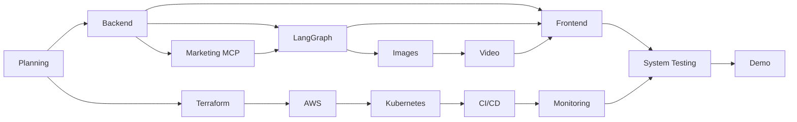
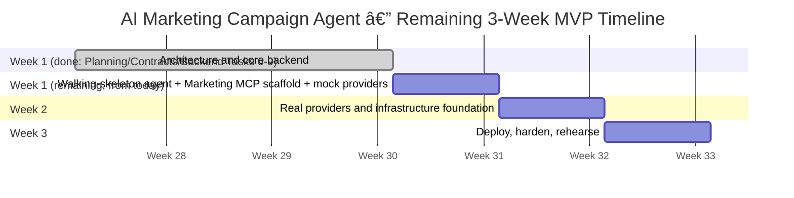

# AI Marketing Campaign Agent — Implementation Plan

## 1. Project Overview

### Objective

Build an AI-powered platform that converts a simple marketing request into a complete, downloadable marketing campaign containing strategy, audience analysis, copy, images, storyboard, voice-over, and a promotional MP4.

### Business Value

- Reduce campaign creation time from days to minutes.
- Give non-technical users a repeatable campaign-production workflow.
- Produce consistent, reusable text and media assets from one request.
- Demonstrate practical integration of AI orchestration, MCP, cloud infrastructure, DevOps, and observability.

### Expected Outcome

A single demo user submits a request, tracks asynchronous generation, reviews every generated asset, approves or revises an immutable campaign version, and downloads a final package only after approval.

### Success Criteria

- A valid request produces every required MVP asset.
- Long-running media tasks execute asynchronously.
- Campaign state and assets survive service restarts.
- Failed stages are visible, logged, and retryable.
- The complete solution runs locally with Docker.
- The solution deploys to AWS and Kubernetes.
- CI/CD validates, publishes, deploys, smoke-tests, and supports rollback.
- Prometheus and Grafana expose system and campaign health.
- The primary demo completes reliably within the presentation window.

## 2. MVP Scope

### Included Features

- Marketing request form with product, objective, audience, tone, platforms, and optional brand constraints.
- Marketing strategy and target audience analysis.
- Headlines, social captions, CTA options, and hashtags.
- AI-generated campaign images.
- Storyboard, voice-over script, and voice-over audio.
- Short promotional MP4 video.
- Campaign creation, status tracking, retrieval, validation, metadata, and history.
- Asset storage and downloadable campaign archive.
- React/TypeScript frontend and FastAPI backend.
- LangGraph orchestration and Amazon Bedrock integration.
- Custom Marketing MCP, Image Generator MCP, and HyperFrames MCP integration.
- AWS S3, DynamoDB, SQS, EC2, IAM, and ECR.
- Docker, kubeadm Kubernetes, Terraform, GitHub Actions, Prometheus, Grafana, and structured logging.

### Out of Scope

- Direct social publishing or advertising-platform integration.
- Payments, subscriptions, enterprise identity, and advanced authorization.
- Multi-user collaborative editing and team approval workflows.
- Full video editor or mobile application.
- Custom model training and automated legal approval.
- Live campaign-performance analytics.
- Large-scale production autoscaling and multi-region recovery.

### Future Improvements

- Social publishing and scheduling.
- A/B variants and performance feedback.
- Brand kits, templates, and brand-document retrieval.
- Multilingual campaigns.
- Multi-user team review, authentication, quotas, and cost controls.
- Additional human-in-the-loop gates beyond mandatory final review.
- Managed Kubernetes, autoscaling, and disaster recovery.

## 3. High-Level Milestones


| ID  | Milestone        | Outcome                                                     |
| ----- | ------------------ | ------------------------------------------------------------- |
| M1  | Planning         | Approved scope, contracts, backlog, and acceptance criteria |
| M2  | Backend          | Operational API and persistence interfaces                  |
| M3  | LangGraph Agent  | Executable campaign workflow                                |
| M4  | Marketing MCP    | Campaign, validation, metadata, asset, and packaging tools  |
| M5  | Image Generation | Generated, stored, and viewable images                      |
| M6  | Video Generation | Storyboard, voice-over, and MP4                             |
| M7  | Frontend         | Complete request-to-download journey                        |
| M8  | AWS              | Required cloud services and permissions                     |
| M9  | Terraform        | Reproducible infrastructure                                 |
| M10 | Kubernetes       | kubeadm cluster and deployed workloads                      |
| M11 | CI/CD            | Automated validation and deployment                         |
| M12 | Monitoring       | Metrics, dashboards, logs, checks, and alerts               |
| M13 | Testing          | Verified functional and operational quality                 |
| M14 | Demo             | Stable release and rehearsed presentation                   |



## 4. Work Breakdown Structure (WBS)

### Planning

- Confirm deadline, submission rules, and demo duration.
- Approve the MVP, exclusions, primary demo, and backup demo.
- Map the user journey and freeze the exact campaign-version lifecycle in `docs/contracts/campaign-lifecycle.md`.
- Define component boundaries and freeze the typed state/data model, SQS, API, artifact, error, event, and progress contracts under `docs/contracts/`.
- Identify synchronous and asynchronous work.
- Confirm external accounts, credentials, quotas, and costs.
- Define environments, naming, branching, review, and release conventions.
- Create milestone acceptance criteria, backlog, estimates, risk register, and decision log.
- Set scope-freeze and release-candidate dates.

### Backend

- Create FastAPI project and dependency management.
- Add validated settings and environment templates.
- Configure structured JSON logging and correlation IDs.
- Add exception, CORS, and request-timing middleware.
- Create versioned routes plus liveness, readiness, and metrics endpoints.
- Define request, response, status, stage, and asset models.
- Add the frozen create/list/detail/events/artifacts/approve/revisions/retry/cancel routes.
- Add consistent validation, errors, idempotency, timeouts, and retries.
- Create service and repository boundaries.
- Implement local, DynamoDB, S3, and SQS adapters.
- Generate API documentation and add unit/API tests.

### LangGraph Agent

- Define workflow state, inputs, outputs, nodes, transitions, and terminal states.
- Implement request normalization, strategy, audience, headline, caption, CTA, hashtag, image-prompt, storyboard, voice-over, and validation nodes.
- Add Amazon Bedrock and MCP client adapters.
- Validate structured model outputs.
- Add durable checkpoints, retries, failure transitions, and partial results.
- Track prompt version, model, token usage, and duration.
- Add deterministic mocks, node tests, transition tests, and complete workflow tests.

### Marketing MCP

- Create the MCP server and lifecycle configuration.
- Define versioned tool schemas.
- Implement campaign create, get, update, and status tools.
- Implement validation, metadata, asset registration, and asset retrieval tools.
- Implement package creation and retrieval tools.
- Connect DynamoDB and S3.
- Add schema validation, idempotency, authorization boundaries, timeouts, retries, logs, and metrics.
- Add contract, persistence, duplicate-call, and failure-path tests.
- Document all tools and expected results.

### Image Generation

- Confirm Image Generator MCP interface and credentials.
- Define request, response, progress, and asset metadata.
- Generate prompts from campaign and storyboard context.
- Submit requests and track status.
- Handle rejected prompts, timeouts, and transient errors with bounded retries.
- Validate file type, size, and dimensions.
- Upload images to S3 and register them through Marketing MCP.
- Add secure access, thumbnails if needed, progress UI, provider mocks, integration tests, and demo quality review.

### Video Generation

- Confirm HyperFrames MCP and voice provider interfaces.
- Define storyboard scene and rendering-job contracts.
- Generate scene descriptions, durations, voice-over script, and audio.
- Validate audio and associate images with scenes.
- Create the SQS workflow queue and dead-letter queue.
- Create the worker and consume jobs idempotently.
- Download assets, assemble scenes, captions, transitions, and audio, and produce MP4.
- Upload video to S3, register metadata, and update campaign progress.
- Add retries, visibility renewal, timeouts, diagnostics, health checks, and metrics.
- Test success, slowness, duplicates, restarts, and failures.

### Frontend

- Create React/TypeScript project with routing, linting, and environment settings.
- Create typed API client and centralized request/error handling.
- Build and validate the campaign request form.
- Build progress polling and stage-level status views.
- Build results views for all text and media assets.
- Add image gallery, storyboard, audio player, video player, history, and package download.
- Add loading, empty, expired, partial, and recoverable error states.
- Add responsive and accessible behavior.
- Add component, mocked API, and end-to-end tests.

### AWS

- Select region and define development/demo environments.
- Define networking and security groups.
- Create least-privilege IAM roles and policies.
- Create encrypted S3 bucket with lifecycle rules.
- Create DynamoDB table with recovery settings.
- Create SQS workflow/DLQ resources and configure visibility extension.
- Create ECR repositories and provision EC2 cluster hosts.
- Configure instance roles, secrets, tags, and cost monitoring.
- Validate connectivity and document backup/teardown.

### Terraform

- Create module and environment structure.
- Pin Terraform/provider versions and define remote state/locking.
- Implement networking, IAM, S3, DynamoDB, SQS, ECR, EC2, and security-group modules.
- Add outputs, tags, variables, validation, and development/demo configurations.
- Format, validate, plan, review, apply, and verify.
- Add CI validation and safe recovery/teardown documentation.

### Kubernetes

- Define control-plane and worker topology.
- Install runtime, kubeadm, kubelet, and kubectl.
- Initialize cluster, join workers, and install network plugin.
- Create namespaces, service accounts, ECR access, ConfigMaps, and Secrets.
- Create Deployments/Services for frontend, backend, agent, Marketing MCP, and worker.
- Configure resources, probes, ingress, restart policy, and rolling updates.
- Deploy monitoring and validate DNS, networking, AWS access, rollouts, pod recovery, and node recovery.
- Document operations and cluster rebuild.

### CI/CD

- Create pull-request and main-branch workflows.
- Run formatting, linting, type checks, unit, API, MCP, and integration tests.
- Validate Terraform and Kubernetes manifests.
- Build images and tag with immutable commit identifiers.
- Authenticate to AWS, push to ECR, and record digests.
- Deploy to Kubernetes, wait for rollout, and run smoke tests.
- Publish reports, protect demo deployment, and implement/test rollback.

### Monitoring

- Define metric and log conventions.
- Instrument API, workflow, MCP, AI, image, video, queue, and process metrics.
- Deploy Prometheus and Grafana.
- Create executive, API, workflow, AI/MCP, media, and infrastructure dashboards.
- Add structured logs with service, environment, correlation ID, campaign ID, stage, and job ID.
- Configure health checks and alert rules.
- Validate dashboards and alerts during system tests.

### Testing and Demo

- Define environments, fixtures, mocks, owners, and release gates.
- Complete unit, contract, API, integration, end-to-end, performance, resilience, and smoke tests.
- Test timeouts, duplicate jobs, dependency failures, restarts, and recovery.
- Track defects and retain evidence.
- Prepare primary/backup campaigns, presentation, architecture visuals, recorded demo, and recovery instructions.
- Rehearse, freeze, smoke-test, and tag the final release.

## 5. Development Roadmap

### Four-Week Delivery Strategy

The schedule is a fixed four-week MVP plan. Critical-path work takes priority; optional work is removed before acceptance criteria are weakened. Contracts freeze at the end of Week 1, feature scope freezes during Week 4, and generated artifacts are never called final before approval.

### Dependency Rules

- Freeze lifecycle, version, API, MCP, and queue contracts before broad integration.
- Verify all external access, quotas, credentials, latency assumptions, and cost during Week 1.
- Make persistence, idempotency, checkpoints, leases, and queue delivery work before media integration.
- Persist and validate each stage before advancing to the next.
- Provision ECR and EC2 before kubeadm deployment validation.
- Finish the complete user approval path before release hardening.

### External-Service Gate

Week 1 must verify Amazon Bedrock model access, Image Generator MCP availability, HyperFrames MCP credentials/endpoints, TTS availability, quotas, and expected costs. Record the selected models/endpoints and test results without committing secrets. HyperFrames is currently accepted as capability-verified but OAuth-blocked; runtime schema capture, credit verification, and one minimal render are a required gate before final integration, not a blocker for contract work. If a media provider is unavailable for the live demo, the backup demonstration may use previously generated assets while still showing queue processing, checkpoints, stored provider metadata, review, approval, and finalization.

## 5a. Implementation Status and Approved Architecture Decisions (as of 2026-08-03)

### Status: Tasks 6-9 complete

FastAPI creates the campaign/version record and publishes the job before returning `202`, using a dependency-injected DynamoDB repository (Task 7) and Standard SQS producer (Task 8), on top of the API boundary established in Task 6. `QUEUE_BACKEND=memory` remains the safe local default; `sqs` requires region and queue URL. Initial `META` and `VERSION#1` are committed as `CREATED`, the validated `START` message is sent, and an optimistic update moves state to `QUEUED`; `202` is returned only after all three steps succeed, with guarded compensation on definitive send failure and preserved `CREATED`/stable `job_id` on read-timeout ambiguity.

Task 9 added a standalone Python worker that long-polls Standard SQS, validates the envelope, acquires a conditional DynamoDB lease (heartbeat-extended alongside SQS visibility), and records duplicate completion via an `IDEMPOTENCY` entity. It currently uses a durable no-op checkpoint solely to prove this transport boundary — it does not yet run the LangGraph generation workflow or change campaign generation status. That workflow execution is the subject of the Week 1 (remaining) work below.

### Approved architecture decisions (post-Task-9 review)

The following were confirmed through an architecture review conducted after Task 9 and apply to all subsequent work:

- **LangGraph is a stateless per-invocation executor.** DynamoDB is the sole source of truth for workflow durability; LangGraph's native checkpointer/`interrupt()` persistence is not used, to avoid two competing sources of truth for workflow progress.
- **Marketing MCP is deployed as its own service** (own container/deployment), not in-process with the LangGraph worker.
- **One kubeadm cluster, two namespaces.** `dev` and `prod` are Kubernetes namespaces within a single cluster; GitHub Actions deploys to `dev` first and promotes the same validated image digest to `prod` — preserving the promotion workflow without a second cluster's cost/risk.
- **Observability scope is reduced for MVP:** three Grafana dashboards (Campaign Workflow, Queue/DLQ, Kubernetes pod health), no alerting. Executive/API/Agent-LLM/MCP/Media dashboards and KPI-based alerting are deferred (see Section 15).
- **Security-group-restricted access, no production TLS for MVP.** A self-signed certificate is acceptable only if browser HTTPS is required for the demo, explicitly documented as an MVP/demo decision. Production-grade TLS is deferred future work.
- **Delivery follows a walking-skeleton strategy:** prove one complete `CREATE -> ... -> FINAL` path end-to-end (with mock/fallback media providers) before investing in infrastructure polish, then layer in real providers and infrastructure hardening behind the same interfaces.
- **Frontend begins once the Week 1 backend walking-skeleton tasks are complete, not in parallel with them.** A sequencing review (2026-08-03) confirmed three screens (Create, List, Detail+Progress+Polling) have zero backend blocker and could theoretically start immediately, but the solo delivery sequence favors finishing the backend walking skeleton first rather than context-switching between two tracks from day one. Frontend work — and the six still-unbuilt lifecycle API endpoints (`/approve`, `/revisions`, `/retry`, `/cancel`, `/events`, `/artifacts`) it depends on — begins at the start of Week 2. Per the existing Priority Matrix (Section 9), "results UI" and "package" are Critical and "retries" is High — frontend is not optional polish.

### Updated remaining sequencing (walking-skeleton-first)

- **Week 1 (from 2026-08-03):** kubeadm cluster spike (1 control-plane + 1 worker EC2), run in parallel with everything else; continue pursuing HyperFrames/Image Generator MCP credential access in the background. Quick fixes: wire a `REPOSITORY_BACKEND=memory|dynamodb` switch into the API's composition root (mirroring `QUEUE_BACKEND`); fix the worker's structured JSON logging so `correlation_id`/`campaign_id` are real fields, not string-interpolated; delete the now-redundant `acquire_processing_lease`/`heartbeat_processing_lease` methods on the API's DynamoDB repository; promote the `STEP` entity to a typed model. Build the LangGraph agent as a stateless per-invocation executor over the six nodes that need no blocked provider (`receive_request` through `create_storyboard`), with STEP skip/reuse logic for targeted regeneration and a shared cancellation-checkpoint wrapper. Start Marketing MCP as its own service. Build the provider abstraction interface with mock image/video implementations, clearly distinct from genuine disclosed fallback assets. Exit criterion: a full `CREATE -> ... -> READY_FOR_REVIEW -> APPROVE -> FINAL` run works end-to-end locally with mocked media.
- **Week 2 (backend):** wire real HyperFrames/Image Generator MCP implementations behind the provider interface as access unblocks; the moment either produces one real success, bank it immediately as the canonical fallback asset. Build the six remaining lifecycle API endpoints (`/approve`, `/revisions`, `/retry`, `/cancel`, `/events`, `/artifacts`) — status-transition validation via the existing `campaign_contracts.validation.TRANSITIONS` machinery, wired to real queue `RESUME`/`REGENERATE` submission and to Marketing MCP for content/asset persistence. Minimal Prometheus `/metrics` on the worker's new health-probe endpoint, targeting the three approved dashboards. Terraform in dependency order: `s3`/`dynamodb`/`sqs`+DLQ/scoped `iam` first, then the kubeadm cluster (formalizing the Week 1 spike) with `dev`/`prod` namespaces, then Marketing MCP's own deployment/Service/container. Pin the Image Generator MCP's exact version into its (sidecar) image. Apply the security-group restriction and the no-production-TLS decision.
- **Week 2 (frontend, new track, starts once Week 1's backend tasks are done):** scaffold the React/TypeScript project with a typed API client generated against the frozen `docs/contracts/generated/*.schema.json` response shapes. First milestone: Create Campaign page, Campaign List, Campaign Detail with progress visualization and 2-5s polling — built against the three already-stable endpoints. Second milestone, integrated as each backend endpoint lands (built against contract-accurate mocks first if the backend isn't ready yet, per the same mock-first-then-real pattern already used for providers): READY_FOR_REVIEW screen with real asset preview, Approve, Request Revision, Download Package. Retry/Cancel screens if time allows within the week — first candidates to trim (High, not Critical, per Section 9). Baseline loading/error states and a single responsive layout across all screens built so far; full responsive polish is deferred (Medium priority). Week 2 exit criterion: the full approval journey — create, watch progress, review real/honestly-disclosed-fallback content, approve or request revision, download package — works end-to-end in a browser, deployed to the cluster's `dev` namespace.
- **Week 3:** deploy to the cluster; PR quality gates, then GitHub Actions deploys to `dev`, validates, and promotes the same image to `prod` (self-approved, solo project). Add rate limiting on `POST /campaigns`/`POST /retry`. Frontend: remaining responsive-layout and loading/error polish, Retry/Cancel if not already done, a baseline accessibility pass. Rehearse the failure path deliberately — simulate a provider outage mid-run and confirm `fallback_asset=true` disclosure surfaces correctly in the browser, not just in backend behavior. Reserve the last 2-3 days as slip buffer; if Week 2 overruns, Retry/Cancel/responsive-polish/dashboard-depth are the first items cut, per the existing Section 9 shedding policy.

### Explicitly deferred (tracked, not forgotten)

- Reconciling this document's Section 7 folder-layout plan (`agent/`, `marketing-mcp/`, `LangGraph worker/`) against the actual repository layout (`services/api`, `services/worker`, plus a new Marketing MCP service directory) — low priority, cosmetic.
- Collapsing the duplicate Feature Checklist (Section 8) and Master TODO List (Section 18) into one tracking surface — low priority.
- CORS, container hardening (non-root/read-only images), and CI secret/dependency/container/IaC scanning — correctly deferred until their prerequisites (frontend, Dockerfiles, CI pipeline) exist; tracked here so they are not dropped once those land.

## 6. Four-Week Implementation Plan

| Week | Phase | Required Work | Exit Criteria |
|---:|---|---|---|
| 1 | Architecture and Core Backend | Freeze MVP/contracts; finalize lifecycle, immutable versions, APIs, queue messages, and acceptance criteria; create schemas/fixtures; implement FastAPI create/read; implement DynamoDB campaigns, versions, checkpoints, events, and leases; implement SQS submission/consumption, duplicate protection, visibility handling, and DLQ; build initial resumable LangGraph workflow; connect Amazon Bedrock; verify every external-service assumption and cost. | A request returns `202`; one durable version/job exists; duplicate delivery is safe; a restarted worker resumes; Bedrock and provider feasibility are evidenced. |
| 2 | AI and Media Workflow | Build Marketing MCP; integrate Image Generator MCP and HyperFrames MCP; generate strategy, copy, storyboard, images, audio, and video; persist outputs/checkpoints; implement bounded retries, resume, cancellation boundaries, and targeted regeneration; validate S3 assets and metadata. | A queued version reaches `READY_FOR_REVIEW`; failures preserve output; targeted revision creates version `n+1`; assets are private, valid, and durable. |
| 3 | Frontend, AWS, and Kubernetes | Build React submission, polling, progress, review, approval, revision, retry, cancellation, and final download; add presigned URLs; containerize local services; provision AWS with Terraform; create one control plane and one worker; bootstrap kubeadm, install CNI, join worker; deploy React, FastAPI, LangGraph worker, Marketing MCP, local MCPs where applicable, Prometheus, and Grafana; validate ECR pulls and service communication. | The end-to-end approval journey runs on the minimum two-node kubeadm cluster; only an approved version becomes `FINAL`; pods have probes and resource requests/limits. |
| 4 | CI/CD, Testing, and Final Delivery | Implement GitHub Actions tests, builds, ECR push, Kubernetes deployment, smoke tests, and rollback; add metrics/dashboards; run E2E, retry, resume, duplicate-delivery, security, recovery, and basic performance tests; rebuild kubeadm from documented steps; freeze scope; prepare release candidate, documentation, backup demo, presentation, and rehearsal. | Critical tests and rollback pass; cluster rebuild is demonstrated; no critical demo-path defect remains; final documents and backup evidence are complete. |

### Optional Work

Additional EC2 workers and CPU-based HPA may be attempted only after all exit criteria pass. KEDA and queue-based autoscaling are future enhancements and are not MVP acceptance requirements.

## 7. Folder Creation Plan

Create folders in this order:

```text
docs/
docs/contracts/
services/
services/api/
services/api/src/campaign_api/
services/api/tests/
shared/
shared/src/campaign_contracts/
shared/fixtures/
shared/tests/
frontend/
frontend/src/
frontend/tests/
agent/
agent/src/
agent/tests/
marketing-mcp/
marketing-mcp/src/
marketing-mcp/tests/
LangGraph worker/
LangGraph worker/src/
LangGraph worker/tests/
shared/testing/
infra/
terraform/
terraform/modules/
terraform/environments/
k8s/
k8s/base/
k8s/overlays/
monitoring/
monitoring/prometheus/
monitoring/grafana/
tests/
tests/integration/
tests/e2e/
tests/performance/
scripts/
.github/
.github/workflows/
```

## 8. Feature Checklist

### Backend

- [ ]  FastAPI foundation, settings, and environment validation
- [ ]  JSON logging, correlation IDs, middleware, CORS
- [x]  Task 6 FastAPI create/list/detail plus liveness/readiness boundary using in-memory adapters
- [x]  Task 7 dependency-injected DynamoDB repository with atomic initial writes, optimistic locking, guarded rollback, leases, health check, and integration tests
- [x]  Task 8 dependency-injected Standard SQS producer, backend selection/readiness, stable retry identity, guarded send-failure compensation, and documented partial-failure reconciliation
- [x]  Task 9 standalone SQS consumer boundary with validation, conditional leases, visibility heartbeat, durable no-op checkpoint, duplicate handling, redrive-compatible retry bounds, readiness, and graceful shutdown; workflow execution remains deferred
- [ ]  Metrics and later lifecycle endpoints
- [ ]  Typed campaign state, exact lifecycle, immutable versions, artifacts, errors, and events
- [ ]  Create, list, detail, events, artifacts, approve, revisions, retry, and cancel
- [ ]  Validation, errors, idempotency, timeouts, and retries
- [ ]  Local, DynamoDB, S3, and SQS adapters
- [ ]  API documentation and tests

### Frontend

- [ ]  React/TypeScript, routing, configuration, and typed API client
- [ ]  Request form and validation
- [ ]  Submission, polling, progress, and recovery
- [ ]  Strategy, audience, headlines, captions, CTA, and hashtag views
- [ ]  Image gallery, storyboard, audio, and video
- [ ]  History and package download
- [ ]  Loading, empty, partial, responsive, and accessible states
- [ ]  Component and end-to-end tests

### Agent

- [ ]  Graph contracts, state, nodes, transitions, and checkpoints
- [ ]  All text, image-prompt, storyboard, voice-over, and validation nodes
- [ ]  Amazon Bedrock and MCP adapters
- [ ]  Structured output validation
- [ ]  Retries, failure paths, and partial results
- [ ]  Prompt/model/token/duration metadata
- [ ]  Node, transition, recovery, and workflow tests

### Marketing MCP

- [ ]  Server lifecycle and versioned schemas
- [ ]  Campaign management tools
- [ ]  Validation and metadata tools
- [ ]  Asset and packaging tools
- [ ]  DynamoDB and S3 integration
- [ ]  Validation, idempotency, authorization, retries, logs, and metrics
- [ ]  Contract/failure tests and documentation

### Image and Video

- [ ]  Image Generator MCP and HyperFrames MCP connections
- [ ]  Prompt, scene, voice, and render job contracts
- [ ]  Progress tracking, timeouts, retries, and fallbacks
- [ ]  Image/audio/video validation and S3 storage
- [ ]  SQS workflow job and dead-letter queues
- [ ]  Idempotent, lease-protected LangGraph worker
- [ ]  MP4 playback, diagnostics, metrics, and health
- [ ]  Mocks and integration tests

### Infrastructure and Delivery

- [ ]  AWS networking, IAM, S3, DynamoDB, SQS, ECR, and EC2
- [ ]  Terraform state, modules, environments, checks, and teardown
- [ ]  kubeadm cluster, networking, namespaces, workloads, Services, and ingress
- [ ]  ConfigMaps, Secrets, resources, and probes
- [ ]  Pull-request and main CI/CD workflows
- [ ]  Immutable images, ECR push, deployment, smoke tests, and rollback
- [ ]  Prometheus, Grafana, structured logs, health checks, and alerts

### Quality and Demo

- [ ]  Unit, API, MCP, integration, end-to-end, performance, and resilience tests
- [ ]  Deployment smoke tests and final regression
- [ ]  README, plan, specification, diagrams, runbooks, and reports
- [ ]  Presentation, primary/backup campaigns, backup video, rehearsal, and final tag

## 9. Priority Matrix


| Priority | Work                                                                                                           |
| ---------- | ---------------------------------------------------------------------------------------------------------------- |
| Critical | API, text graph, Marketing MCP, persistence, images, video, results UI, package, Docker, core tests, demo path |
| High     | AWS, Terraform, Kubernetes, CI/CD, logging, health, metrics, retries, backups                                  |
| Medium   | History, detailed dashboards, alerts, performance/resilience tests, UI refinement                              |
| Low      | Multiple variants, advanced filters, sophisticated animation, optional environments                            |

Complete critical work before expanding scope. Remove low-priority work first when time, provider, or infrastructure risk rises.

## 10. Dependencies


| Milestone     | Prerequisites         | Dependencies                | Blockers                      |
| --------------- | ----------------------- | ----------------------------- | ------------------------------- |
| Backend       | Approved contracts    | Python/FastAPI              | Undefined lifecycle           |
| Agent         | Backend contracts     | Amazon Bedrock access       | Unstable state model or missing model access |
| Marketing MCP | Campaign contracts    | MCP runtime/storage         | Undefined tool schemas        |
| Images        | Text workflow         | Image Generator MCP/S3                | Credentials or asset contract |
| Video         | Storyboard/images     | HyperFrames, voice, SQS, S3 | Render contract/assets        |
| Frontend      | API contract          | Backend/asset access        | Frequent schema changes       |
| AWS/Terraform | Environment design    | Account, IAM, state         | Quotas/permissions            |
| Kubernetes    | Hosts/images          | kubeadm, networking, ECR    | Cluster connectivity          |
| CI/CD         | Stable commands       | GitHub, ECR, cluster access | Missing secrets               |
| Monitoring    | Instrumented services | Prometheus/Grafana          | Missing metrics               |
| Testing       | Stable contracts      | Mocks/test environments     | Provider instability          |
| Demo          | Release candidate     | All critical milestones     | Critical defects              |

## 11. Risks


| Risk                       | Category    |   Impact | Mitigation                                                |
| ---------------------------- | ------------- | ---------: | ----------------------------------------------------------- |
| Workflow complexity        | Technical   |     High | Deliver text-only graph first                             |
| Contract drift             | Technical   |     High | Versioned shared contracts and contract tests             |
| Blocking media work        | Technical   |     High | SQS and the dedicated LangGraph worker                    |
| Unexpected cost            | Cloud       |     High | Budgets, tags, lifecycle, small hosts, teardown           |
| Incorrect IAM              | Cloud       |     High | Least privilege and early access tests                    |
| Provider latency/quota     | AI          |     High | Timeouts, bounded retries, quota checks, backups          |
| Invalid/unsafe output      | AI          |     High | Structured validation, content checks, manual demo review |
| MCP mismatch/outage        | Integration |     High | Shared schemas, mocks, fallbacks, cached assets           |
| Expired asset URLs         | Integration |   Medium | Direct S3 worker access or refreshed links                |
| Queue timeout              | Video       |     High | Measure rendering and tune visibility timeout             |
| Audio/video mismatch       | Video       |   Medium | Explicit scene durations and validation                   |
| Worker resource exhaustion | Video       |     High | Short videos, limits, measured capacity                   |
| Unsupported MP4            | Video       |     High | Standard codec and browser testing                        |
| Single control-plane failure | Deployment | High | Accept for MVP; document and rehearse complete rebuild    |
| kubeadm/CNI/join failure     | Deployment | High | Pin versions; validate bootstrap and worker join early     |
| Control-plane certificate expiry | Deployment | Medium | Document certificate checks and renewal procedure       |
| Broad node IAM role          | Security | High | Least privilege, IMDSv2, no static keys, document limitation |
| Failed rollback            | Deployment  |     High | Immutable tags and tested rollback                        |
| Secret exposure            | CI/CD       | Critical | Protected short-lived credentials and masked logs         |
| Live demo outage           | Demo        | Critical | Backup campaign, media, screenshots, and recording        |
| Schedule overrun           | Project     | Critical | Scope freeze and simpler media fallback                   |

## 12. Testing Strategy

### Unit Tests

Validation, graph nodes, state transitions, parsing, metadata mapping, packaging, retries, worker job parsing, and frontend components.

### Integration Tests

Backend with DynamoDB/S3/SQS; agent with MCP/providers; image registration; worker with HyperFrames/storage; package assembly.

### API Tests

Create, list, detail, events, artifacts, approve, revisions, retry, cancel, invalid input, missing records, partial results, idempotency, precondition conflicts, and dependency failures.

### MCP Tests

Discovery, schemas, campaign tools, validation, metadata, assets, packaging, duplicate calls, timeouts, and permissions.

### End-to-End Tests

Submit request; generate text; generate/store images; create storyboard/audio; render/store video; display results; download package; retrieve history.

### Performance Tests

API latency under polling, campaign throughput, stage duration, queue wait, rendering time, worker CPU/memory, package time, and asset transfer.

### Resilience Tests

Provider timeouts, throttling, storage failure, worker restart, duplicate delivery, expired access, pod restart, and partial recovery.

### Demo Validation

Repeat the exact demo request; confirm quality, duration, playback, archive contents, dashboards, logs, backups, and recorded demo.

### Release Exit Criteria

All critical tests pass; no critical or demo-path high defect remains; smoke tests and rollback pass; documentation and evidence are complete.

## 13. Deployment Plan

1. **Local Development:** Run applications with local adapters and provider mocks. Exit when the text workflow works.
2. **Docker:** Build non-root, health-checked images and run the entire stack locally. Exit when the MVP works in containers.
3. **AWS:** Provision with Terraform, push to ECR, and connect S3/DynamoDB/SQS through roles. Exit when cloud dependencies support E2E.
4. **Kubernetes:** Build kubeadm cluster, deploy workloads/configuration/ingress/monitoring, and test rollouts. Exit when smoke and E2E tests pass.
5. **Production/Demo:** Deploy a protected tag, verify quotas/backups/alerts, run regression, and freeze changes. Exit when stable and recoverable.

## 14. CI/CD Plan

### Pull Request

1. Formatting, linting, and type checking.
2. Unit, API, and MCP tests.
3. Terraform and Kubernetes validation.
4. Docker build without publishing.
5. Test and coverage reports.

### Main Branch

1. Repeat required checks and run integration tests.
2. Build images and tag with commit SHA.
3. Authenticate to AWS and push to ECR.
4. Record image digests.
5. Deploy to Kubernetes and wait for rollout.
6. Run health, campaign-creation, storage, queue, and metrics smoke tests.
7. Report outcome and preserve evidence.

### Rollback

Stop promotion; capture diagnostics; redeploy last known-good digests; verify rollout; repeat smoke tests; restore versioned configuration if needed; record corrective actions. Keep contracts backward-compatible while the previous release is a rollback target.

## 15. Monitoring Plan

### Prometheus Metrics

- Campaign success rate, duration, failures, retries, stages, and active count.
- Image generation and video rendering times/errors.
- MCP requests, errors, retries, and duration.
- Amazon Bedrock latency, errors, token usage, throttling, and estimated cost metadata.
- API request rate, latency, and errors.
- Queue depth, wait time, and dead-letter messages.
- CPU, memory, disk, network, pod restarts, S3 errors, and DynamoDB throttling.

### Grafana Dashboards

MVP scope is reduced to three dashboards, chosen to carry the demo narrative (see Section 5a); the rest are deferred future work.

| Dashboard      | Content                                            | Status |
| ---------------- | ---------------------------------------------------- | --- |
| Workflow       | Stage duration, retries, failures, completion      | MVP |
| Queue          | Queue depth, wait time, dead-letter messages       | MVP |
| Infrastructure | CPU, memory, disk, pods, nodes                     | MVP |
| Executive      | Success, duration, active stages, latest campaigns | Deferred |
| API            | Traffic, latency, codes, errors                    | Deferred |
| AI/MCP         | Provider latency, tokens, errors, MCP health       | Deferred |
| Media          | Image time, render time, queues, workers           | Deferred |

### Structured Logs, Checks, and Alerts

Logs include timestamp, severity, service, environment, correlation ID, campaign ID, stage, job ID, event, retry count, and duration without secrets. Health checks cover backend, MCP, agent, worker, storage, queues, pods, nodes, and scrape targets. Alerting is deferred entirely for MVP (no on-call audience for a graduation demo); health checks, not alert rules, are the operative MVP mechanism. A future alert set would cover downtime, error rate, latency, provider failures, queue backlog, dead-letter messages, slow rendering, restarts, CPU, memory, and disk.

### KPI Targets


| KPI                   | MVP Target                                          |
| ----------------------- | ----------------------------------------------------- |
| Campaign Success Rate | At least 90% for approved demo inputs               |
| Campaign Duration     | Within the agreed demo window                       |
| Video Rendering Time  | Below the tested maximum                            |
| Image Generation Time | Measured per image and within provider expectations |
| MCP Errors            | Below 5% in normal operation                        |
| API Latency           | Low for non-generation endpoints                    |
| Queue Length          | Returns to zero after expected workloads            |
| CPU/Memory            | Below sustained saturation and configured limits    |

## 16. Deliverables

- Backend, frontend, LangGraph worker, Marketing MCP, contracts, and tests.
- Dockerfiles and local container configuration.
- Kubernetes manifests and Terraform infrastructure.
- GitHub Actions workflows and ECR images.
- Prometheus configuration, Grafana dashboards, alert rules, and structured logging.
- README, `docs/plan.md`, `docs/spec.md`, diagrams, API/MCP documentation, setup/deployment guides, runbooks, test report, risk register, and decisions.
- Sample campaign package, presentation, live demo, backup demo video, and tagged release.

## 17. Final Project Timeline



Architecture contracts (Section 1 Planning) and Backend Tasks 6-9 are already frozen/complete as of 2026-08-03 (see Section 5a). Freeze feature scope early in the final week, prepare the release candidate at least three days before the presentation, verify the backup demo one day before, and avoid demo-day changes except recovery.

## 18. Master TODO List

### Planning

- [ ]  Confirm requirements, deadline, scope, exclusions, and demo scenarios
- [x]  Freeze lifecycle, typed state/version model, SQS, DynamoDB, API, artifact/error, event/progress contracts, and ownership in `docs/contracts/`
- [x]  Create the standalone `shared/` Pydantic contract package, executable fixtures, generated JSON Schemas, and contract tests
- [ ]  Create backlog, estimates, risks, decisions, freeze date, and release date

### Backend

- [ ]  Create FastAPI, settings, logs, middleware, health, readiness, and metrics
- [ ]  Define models and all campaign routes
- [ ]  Add validation, errors, idempotency, timeouts, and retries
- [ ]  Implement local, DynamoDB, S3, and SQS adapters
- [ ]  Complete API documentation and tests

### Frontend

- [ ]  Create React/TypeScript foundation, routing, and API client
- [ ]  Build request, progress, error, results, history, and download views
- [ ]  Add all text/media previews, responsive behavior, and accessibility
- [ ]  Complete component and E2E tests

### Agent

- [ ]  Define graph contracts, state, nodes, transitions, and checkpoints
- [ ]  Implement every text and media-planning node
- [ ]  Add Amazon Bedrock/MCP adapters, validation, retries, failures, and metadata
- [ ]  Complete node, transition, recovery, and workflow tests

### Marketing MCP

- [ ]  Create server and versioned schemas
- [ ]  Implement campaign, validation, metadata, asset, and package tools
- [ ]  Connect storage and add validation, idempotency, security, retries, logs, and metrics
- [ ]  Complete tests and tool documentation

### Image Generation

- [ ]  Configure Image Generator MCP, requests, prompts, submission, and progress
- [ ]  Add failures, retries, validation, upload, registration, and secure preview
- [ ]  Complete mocks, tests, and demo quality review

### Video Generation

- [ ]  Define scenes, audio, and render jobs
- [ ]  Configure HyperFrames MCP within the SQS-driven LangGraph worker
- [ ]  Assemble, render, upload, register, and preview MP4
- [ ]  Add progress, retries, timeouts, diagnostics, metrics, health, and tests

### AWS

- [ ]  Create VPC, public subnets, Internet Gateway, routes, security groups, IAM, S3, DynamoDB, SQS/DLQ, ECR, Secrets Manager resources, and EC2
- [ ]  Configure secrets, encryption, recovery, lifecycle, tags, and budgets
- [ ]  Validate access and document backup/teardown

### Terraform

- [ ]  Configure versions, provider, remote state, variables, modules, and environments
- [ ]  Add validation, outputs, tags, CI checks, recovery, and teardown
- [ ]  Plan, review, apply, and verify

### Kubernetes

- [ ]  Provision one kubeadm control-plane EC2 node and at least one worker; install CNI and join worker
- [ ]  Create namespaces, accounts, ECR access, config, and secrets
- [ ]  Deploy all workloads, Services, ingress, resources, and probes
- [ ]  Deploy monitoring and validate rollouts/recovery

### CI/CD

- [ ]  Add pull-request and main workflows
- [ ]  Add quality, test, Terraform, and Kubernetes checks
- [ ]  Build/tag/push images and deploy Kubernetes
- [ ]  Run smoke tests, protect demo, and test rollback

### Observability

- [ ]  Instrument metrics and structured logs
- [ ]  Deploy Prometheus/Grafana and create dashboards
- [ ]  Add health checks and tested alerts

### Testing

- [ ]  Define fixtures, mocks, environments, and release gates
- [ ]  Complete unit, API, MCP, integration, E2E, performance, resilience, and smoke tests
- [ ]  Run regression, resolve blockers, and retain evidence

### Documentation

- [ ]  Complete README, plan, specification, diagrams, API/MCP docs, guides, and runbooks
- [ ]  Review documentation against the final deployment

### Presentation

- [ ]  Create problem, objective, architecture, workflow, infrastructure, monitoring, testing, risk, result, and future slides
- [ ]  Add screenshots, script transitions, review timing, and rehearse questions

### Demo

- [ ]  Validate primary and backup requests and assets
- [ ]  Verify quotas, AWS, cluster, dashboards, alerts, logs, and package
- [ ]  Run smoke and full-flow tests
- [ ]  Record backup demo and prepare recovery steps
- [ ]  Freeze, tag, and rehearse the final release
