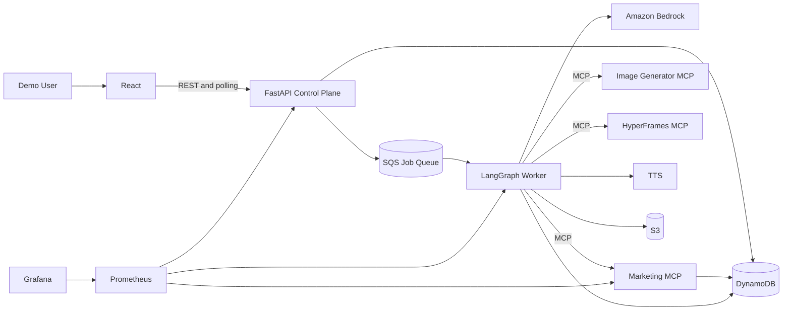
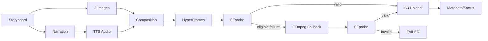

# AI Marketing Campaign Agent — Technical Specification

## 1. Document Overview

### Purpose and Scope

This document is the Software Requirements Specification and System Design Specification for a platform that converts a marketing brief into strategy, copy, images, storyboard, voice-over, video, and a downloadable package. It defines mandatory behavior, interfaces, data, deployment, security, monitoring, recovery, and acceptance.

### Audience and Conventions

Audience: software, AI, frontend, backend, DevOps, QA, operations, and project reviewers. **MUST/SHALL** is mandatory, **SHOULD** is recommended, and **MAY** is optional. Stored timestamps use UTC ISO 8601; JSON uses `snake_case`; requirement IDs are immutable.

| Term | Definition |
|---|---|
| AI Agent | Stateful orchestrator coordinating models and tools. |
| LangGraph | Graph runtime for agent state, nodes, transitions, checkpoints, and resumption. |
| MCP | Model Context Protocol used for controlled tool execution. |
| CTA | Call To Action. |
| Storyboard | Ordered timed scenes with narration, overlays, visuals, and transitions. |
| TTS | Text-to-Speech. |
| Campaign Package | Validated archive of campaign content and media. |
| SQS | Amazon Simple Queue Service. |
| HPA | Kubernetes Horizontal Pod Autoscaler. |
| MVP | Minimum Viable Product defined in Section 5. |

## 2. System Overview

Small organizations lack time and integrated skills to create coordinated campaigns. The single-user graduation-project MVP accepts one brief, creates a durable campaign version, queues asynchronous work, orchestrates AI generation, stores progress and checkpoints, renders media, and finalizes automatically with no human review step required. Amazon Bedrock, Image Generator MCP, HyperFrames MCP, TTS, AWS, and GitHub are external dependencies.

Required output: strategy, audience analysis, campaign message, headline, caption, CTA, hashtags, three images, three-scene storyboard, voice-over audio, approximately 15-second MP4, manifest, and a finalized downloadable archive.



## 3. User Personas

| Persona | Description | Goals | Pain Points | Interactions |
|---|---|---|---|---|
| Small Business Owner | No dedicated creative team. | Launch quickly and affordably. | Limited time/expertise. | Submit, answer questions, preview, download. |
| Marketing Professional | Creates campaigns for teams/clients. | Obtain consistent drafts/assets. | Repetitive fragmented workflow. | Detailed brief, monitor, inspect, retry. |
| Content Creator | Produces frequent social content. | Create short media rapidly. | High cadence/video overhead. | Choose platform/tone, preview/download. |
| System Administrator | Operates platform. | Availability, security, recovery, cost control. | Provider errors/backlogs. | Dashboards, logs, deployment, recovery. |

## 4. Use Cases

| ID / Use Case | Actor / Preconditions / Trigger | Main Flow | Alternatives and Failures | Postcondition |
|---|---|---|---|---|
| UC-001 Create | User submits a valid brief | FastAPI creates campaign/version, enqueues work, returns `202` | Invalid input creates no record | Durable campaign and job exist |
| UC-002 Validate Brief | User submits an incomplete or invalid brief | Return field-level `422` errors without creating a campaign | Corrected input may be resubmitted | Only valid briefs create version 1 |
| UC-003 Monitor | Campaign exists | Poll every 2–5 seconds | Back off on temporary API errors | Latest durable state displayed |
| UC-004 View Results | Partial or review output exists | Retrieve structured output and presigned asset URLs | Partial sections are labelled | No mutation |
| UC-005 Review and Approve | Version is `READY_FOR_REVIEW` | Approve the exact immutable version | User may request revision instead | Version becomes `APPROVED` |
| UC-006 Revise | Version is `READY_FOR_REVIEW` | Store scoped feedback, create version `n+1`, queue from earliest affected stage | Invalid scope `400`; conflict `409` | Prior version remains unchanged |
| UC-007 Retry | Version is retryable `FAILED` | Queue resume from last valid checkpoint | Reject exhausted/non-retryable failure | Work resumes once or remains failed |
| UC-008 Cancel | Version is active | Persist cancellation and stop at a safe node boundary | External operation may finish but cannot finalize | Version becomes `CANCELLED` |
| UC-009 Download Package | Version is `FINAL` | Return short-lived presigned archive URL | Pending preparation returns `202` | Approved final package delivered |
| UC-010 History | Campaign exists | Return versions and events | Empty state supported | No mutation |

## 5. MVP Scope

### Included

Single demo user; request validation; asynchronous and resumable LangGraph processing; strategy, copy, storyboard, images, voice-over, and video; immutable campaign versions; automatic finalization, targeted revision, retry, and cancellation (no human approval step); DynamoDB state/checkpoints; S3 binary assets; SQS jobs and DLQ; final downloadable package; kubeadm on EC2; observability; dev/prod configuration.

### Out of Scope

Social publishing, automatic approval, advanced video editing, multi-user collaboration, billing, tenant isolation, enterprise authentication/authorization, long videos, and campaign-performance analytics.

### Future

Authentication/organizations, brand kits, multilingual output, A/B variants, team approval workflows, social scheduling, analytics feedback, quotas, managed Kubernetes, distributed tracing, CPU-based HPA, KEDA/queue-based autoscaling, multi-region recovery, and additional providers.

## 6. Functional Requirements

| ID | Description | Priority | Acceptance Criteria |
|---|---|---|---|
| FR-CAM-001 | Create campaign and unique immutable ID. | Critical | Valid request yields one durable record and `202`; 100k test IDs unique. |
| FR-CAM-002 | Validate and normalize input. | Critical | Invalid fields return deterministic errors and start no work. |
| FR-CAM-003 | Retrieve campaign/history and update valid status. | Critical | Existing data returns; unknown ID `404`; illegal transition `409`. |
| FR-CAM-004 | Store timestamps and sanitized errors. | Critical | UTC times and category/code/stage/retryability are retrievable. |
| FR-AGT-001 | Analyze business/audience and create strategy/message. | Critical | Schema-valid outputs align with goal. |
| FR-AGT-002 | Generate headline, caption, CTA, hashtags. | Critical | All required fields pass schema/length rules. |
| FR-AGT-003 | Generate three prompts/scenes and narration. | Critical | Exactly three scenes totaling 13–17 seconds. |
| FR-AGT-004 | Select registered tools; retry bounded failures. | High | Audit shows allowed tools and configured retry limits. |
| FR-AGT-005 | Handle missing info and resume checkpoints. | Critical | Pauses with questions; restart continues without duplicate side effects. |
| FR-MCP-001 | Create/get/update campaign records. | Critical | Typed valid operations; idempotent mutations. |
| FR-MCP-002 | Save content, status, and asset metadata. | Critical | Schema/transition validation and atomic version update. |
| FR-MCP-003 | Validate and prepare package. | Critical | Missing/corrupt assets block archive; valid campaign yields verifiable ZIP. |
| FR-IMG-001 | Generate exactly three images. | Critical | Three decodable scene-aligned images or correct failure state. |
| FR-IMG-002 | Validate MIME/dimensions and store in S3. | Critical | Accepted assets meet policy and checksum/metadata match. |
| FR-AUD-001 | Generate narration via TTS. | Critical | Supported, decodable audio fits video duration. |
| FR-AUD-002 | Upload audio and metadata. | Critical | Stored object and checksum match. |
| FR-VID-001 | Build/render three-scene composition through HyperFrames. | Critical | Manifest has three ordered scenes and provider job is stored. |
| FR-VID-002 | Use eligible FFmpeg fallback and validate with FFprobe. | Critical | Final output passes container/codec/duration/resolution checks. |
| FR-VID-003 | Upload MP4/render metadata asynchronously. | Critical | API does not block; S3 and metadata agree. |
| FR-FE-001 | Submit request and show validation. | Critical | One valid submission creates one campaign; errors map to fields. |
| FR-FE-002 | Poll/display status and results. | Critical | UI reflects status within polling interval and stops when terminal. |
| FR-FE-003 | Preview media, download package, resume/retry. | Critical | Supported browser completes each action once. |
| FR-API-001 | Expose versioned JSON endpoints and stable errors. | Critical | OpenAPI matches Section 16; errors include code/message/correlation ID. |
| FR-API-002 | Enforce limits and idempotency. | Critical | Oversize returns `413`; duplicate key creates no duplicate work. |

## 7. Non-Functional Requirements

| ID | Requirement | Measurable Acceptance |
|---|---|---|
| NFR-PERF-001 | Non-generation API performance | p95 under 500 ms and p99 under 1 s for the single-user demo polling and interaction profile. |
| NFR-PERF-002 | Creation acknowledgement | p95 =2 s excluding generation. |
| NFR-PERF-003 | Campaign duration | 90% approved demo inputs complete =5 minutes under normal providers. |
| NFR-REL-001 | Retry/transient recovery | Exponential backoff+jitter; configured maximum enforced. |
| NFR-REL-002 | Idempotency/partial preservation | Duplicate calls/jobs do not duplicate assets; completed output survives failure. |
| NFR-REL-003 | Durable worker recovery | Unacknowledged job is redelivered safely; queue retention =4 days. |
| NFR-AVL-001 | Health/readiness/recovery | Failed stateless pod restored and ready =2 minutes. |
| NFR-SCL-001 | Stateless/scalable services | Backend/MCP retain no pod-local durable state; workers scale independently. |
| NFR-SCL-002 | MVP resource control | Deployments define measured CPU/memory requests and limits; HPA is optional and KEDA is deferred. |
| NFR-SEC-001 | Secrets/IAM | No active secret in repo/image; least-privilege role tests pass. |
| NFR-SEC-002 | Input/file/network security | Negative tests reject malformed files/input; only intended ingress is public. |
| NFR-MNT-001 | Typed modular interfaces | API/MCP/messages validate against versioned schemas. |
| NFR-MNT-002 | Configuration/docs/tests | Environment-driven config; current docs; core coverage =80%. |
| NFR-OBS-001 | Traceable operations | Campaign ID locates API, node, MCP, job, and worker logs. |
| NFR-OBS-002 | Visible failures | Failure stores error, emits log/metric, and appears in UI. |

## 8. Input Specification

| Field | Type | Req. | Validation | Example | Default |
|---|---|---:|---|---|---|
| `business_name` | string | Yes | 2–120 trimmed chars | `Northwind Coffee` | — |
| `product_or_service` | string | Yes | 2–200 chars | `Cold brew subscription` | — |
| `business_description` | string | Yes | 20–2000 chars | `Local roaster...` | — |
| `campaign_goal` | enum/string | Yes | supported enum or 3–300 chars | `increase_sales` | — |
| `target_audience` | string | No | 5–1000 chars | `Professionals 25–40` | inferred/asked |
| `platform` | enum[] | Yes | 1–5 unique values | `["instagram"]` | — |
| `tone` | string | No | 2–80 chars | `energetic` | `professional` |
| `language` | BCP-47 | No | supported locale | `en-US` | `en-US` |
| `key_message` | string | No | =500 chars | `Better mornings delivered` | generated |
| `call_to_action` | string | No | =200 chars | `Start today` | generated |
| `video_duration` | integer | No | MVP value 15 | `15` | `15` |
| `video_format` | enum | No | `vertical_9_16` | `vertical_9_16` | same |
| `brand_colors` | HEX[] | No | 0–5 unique valid colors | `["#4B2E2A"]` | `[]` |
| `optional_reference_image` | object/null | No | allowed MIME/size; valid asset | `{"asset_id":"ast_1"}` | `null` |

Unknown fields are rejected; text is normalized/trimmed and treated as untrusted. Arbitrary URL fetching is prohibited.

## 9. Output Specification

Campaign response contains `campaign_id`, `status`, `current_stage`, `strategy`, `target_audience`, `campaign_message`, `headline`, `caption`, `cta`, `hashtags`, `storyboard`, `image_assets`, `audio_asset`, `video_asset`, `package_url`, `timestamps`, and `errors`. Nullable generated fields remain `null` until available. Persistent data stores asset references, not presigned URLs.

Each storyboard scene contains:

| Field | Rule |
|---|---|
| `scene_number` | Integer 1–3, unique/ordered. |
| `purpose` | 3–200 chars. |
| `duration` | Positive; total 13–17 seconds. |
| `narration` | Spoken text. |
| `text_overlay` | Concise text; may be empty. |
| `visual_prompt` | Detailed provider-safe prompt. |
| `image_url` | Nullable short-lived URL. |
| `transition` | Supported value such as cut/fade/crossfade. |

Assets contain ID, type, MIME, size, SHA-256, dimensions/duration, creation time, and short-lived URL. Errors contain code, category, stage, retryable flag, timestamp, and sanitized message.

## 10. Campaign Status Model

The normative lifecycle is defined in [`contracts/campaign-lifecycle.md`](contracts/campaign-lifecycle.md). Status applies to one immutable campaign version, and only these values are allowed:

`CREATED`, `QUEUED`, `GENERATING_STRATEGY`, `GENERATING_COPY`, `GENERATING_STORYBOARD`, `GENERATING_IMAGES`, `RENDERING_VIDEO`, `READY_FOR_REVIEW`, `REVISION_REQUESTED`, `APPROVED`, `FINAL`, `FAILED`, and `CANCELLED`.

FastAPI owns user-command transitions; the leased LangGraph worker owns generation transitions. `READY_FOR_REVIEW` means generated outputs are reviewable, and is also where the worker automatically continues to packaging and `FINAL` in the same processing pass -- no human approval action exists. `APPROVED` is retained in the enum only for backward compatibility with data/messages predating this behavior; nothing currently produces it. Revision (available from `READY_FOR_REVIEW` or `FINAL`) creates version `n+1`; it never mutates version `n` -- a `FINAL` version n's own record is immutable and never rewritten. Retry uses `FAILED -> QUEUED` without introducing a separate retry status. Illegal transitions fail atomically with `409 INVALID_STATE_TRANSITION`. Progress percentages, cancellation boundaries, terminal behavior, and durable event ordering are frozen in the lifecycle contract.
## 11. AI Agent Design

The SQS consumer hosts the LangGraph worker for the complete generation workflow, not only video rendering. State includes campaign ID, immutable version, request, revision scope, structured outputs, provider job IDs, completed nodes, retry counters, errors, lease, and checkpoint version. Every node persists valid output before advancing. Resume verifies idempotency keys and skips committed nodes. Human review is a durable interrupt; no worker waits in memory.

DynamoDB is the sole source of truth for workflow state and durability. LangGraph runs as a stateless per-invocation node graph: each invocation loads the typed campaign state from DynamoDB, executes to the next durable boundary, and persists back through the existing repository. LangGraph's own native checkpointer and `interrupt()` persistence primitives are not used, so that workflow progress never has two independent sources of truth. Concretely, the "durable interrupt" for `await_human_approval` means the graph does not run again until a new queue command arrives — not an in-memory or LangGraph-managed suspension.

| Node | Responsibility |
|---|---|
| `receive_request` | Load version, command, and checkpoint. |
| `validate_input` | Validate syntactic and semantic completeness. |
| `analyze_campaign` | Use Amazon Bedrock for audience and brief analysis. |
| `create_strategy` | Generate positioning and key message. |
| `generate_content` | Generate headline, caption, CTA, and hashtags. |
| `create_storyboard` | Produce three timed scenes and narration. |
| `generate_images` | Invoke Image Generator MCP and persist validated S3 assets. |
| `generate_voiceover` | Create and store narration audio. |
| `render_video` | Invoke HyperFrames MCP, validate, and store video. |
| `validate_review_package` | Verify review outputs, metadata, and checksums. |
| `await_human_approval` | Set `READY_FOR_REVIEW` and interrupt. |
| `prepare_final_package` | After approval, create archive and mark `FINAL`. |
| `handle_failure` | Classify, retry, pause, cancel, or fail. |

Targeted regeneration begins at the earliest affected node: strategy feedback restarts strategy onward; copy feedback restarts content onward; storyboard feedback restarts storyboard onward; image feedback regenerates selected images and dependent video; video feedback restarts rendering. A revision always creates a new version.

## 12. MCP Design

The agent decides what operation is required; MCP performs deterministic audited side effects. Tools enforce schemas, transitions, permissions, and idempotency and do not perform campaign reasoning. All mutating tools accept campaign/correlation/idempotency identifiers. Errors return `code`, `message`, `retryable`, and `correlation_id`.

| Tool | Purpose | Input | Output | Validation, Errors, Idempotency |
|---|---|---|---|---|
| `create_campaign` | Create record | ID, request, timestamps, key | Summary/version | Schema/conflict validation; same key returns original. |
| `get_campaign` | Retrieve | ID/projection | Campaign/version | Typed `NOT_FOUND`; read-only. |
| `update_campaign` | Patch allowed fields | ID, expected version, patch, key | Updated version | Optimistic concurrency; protected fields rejected. |
| `update_campaign_status` | Transition status | ID, from/to, stage, error, key | Status/version | Section 10 enforced; duplicate safe. |
| `save_campaign_content` | Store generated content | ID, type, schema, payload, key | Version/checksum | Typed validation; mismatched duplicate conflicts. |
| `save_asset_metadata` | Register asset | Section 17 fields, key | Asset/version | Campaign, prefix, MIME, checksum validated. |
| `validate_campaign_package` | Verify output | ID, profile | Valid flag/issues/checksums | Read-only; storage errors typed. |
| `prepare_delivery_package` | Build ZIP/manifest | ID, format, key | Package asset | Requires valid output; same version/key returns existing package. |

Image Generator MCP accepts sanitized prompt, aspect ratio/profile, request ID, and optional reference asset, returning provider job/output metadata. HyperFrames MCP accepts immutable render manifest and returns job/status/output. Adapters map errors; all output is independently validated; external MCP services do not write DynamoDB.

Marketing MCP is deployed as its own service, independent of the LangGraph worker process, and is reached over the network like the other two MCPs. Write ownership is split explicitly: the LangGraph worker's repository owns infrastructure bookkeeping (processing leases, heartbeat state, and idempotency markers) via direct conditional DynamoDB writes, while Marketing MCP owns all campaign domain-state writes (status transitions, generated content, asset registration, and packaging). This split is an intentional architectural boundary, not an overlap.

## 13. Video Generation Specification

Pipeline: finalize storyboard; generate three images; generate narration; call TTS; build composition; submit HyperFrames; monitor; FFprobe validate; use FFmpeg fallback if eligible; upload S3; update metadata.

| Attribute | MVP Requirement |
|---|---|
| Duration | Target 15 seconds; accepted 13–17 |
| Scenes | Exactly 3 |
| Format/orientation | MP4, vertical 9:16 |
| Resolution | Preferred 1080×1920; fallback 720×1280 |
| Codecs | H.264 video, AAC audio |
| Frame rate | Fixed 24 or 30 fps |

HyperFrames submission/status uses at most 3 transient retries with exponential backoff/jitter. Existing provider job IDs are polled rather than resubmitted. Default timeout is 10 minutes. Invalid output is re-fetched once, then FFmpeg fallback is attempted once if sources are valid. Manifest/asset validation failures are non-retryable. Every attempt stores provider, times, outcome, and probe data.



## 14. System Architecture

| Component | Responsibility | Protocol | Data Ownership/Dependency |
|---|---|---|---|
| React | Submission, 2–5 second polling, progress, review, lifecycle actions. | HTTPS/JSON | No authoritative state. |
| FastAPI | Campaign creation, reads, lifecycle commands, presigned URLs, SQS submission. | HTTPS/JSON, AWS API | Stateless; DynamoDB is authoritative. |
| LangGraph Worker | Consume SQS and run the complete resumable workflow. | SQS, AWS API, MCP | Execution only; checkpoints live in DynamoDB. |
| Marketing MCP | Typed persistence, transitions, assets, and packaging tools. | MCP | Audited durable operations. |
| Image Generator MCP | Image generation. | MCP | External or separately deployed; accepted assets copied to S3. |
| HyperFrames MCP | Video rendering. | MCP | External or separately deployed. |
| FFmpeg/FFprobe | Eligible fallback and output validation. | Local process | Temporary worker files only. |
| DynamoDB | Campaigns, immutable versions, events, leases, checkpoints, metadata. | AWS API | Source of truth for campaign state. |
| S3 | Images, audio, video, manifests, approved packages. | AWS API | Source of truth for binary assets. |
| SQS/DLQ | At-least-once start, resume, retry, regenerate, finalize delivery. | AWS API | Delivery, never workflow state. |
| ECR/kubeadm Kubernetes | Image registry and runtime. | OCI/Kubernetes | Deployment state. |
| Prometheus/Grafana | Metrics and dashboards. | HTTP | Operational telemetry. |

FastAPI creates the campaign/version record and publishes the job before returning `202`, using a dependency-injected DynamoDB repository and Standard SQS producer. `QUEUE_BACKEND=memory` remains the safe local default; `sqs` requires region and queue URL and readiness uses non-consuming queue attributes. Initial `META` and `VERSION#1` are committed as `CREATED`, the validated identity-only `START` message is sent, and an optimistic update moves state to `QUEUED`; `202` is returned only after all three steps succeed. DynamoDB and SQS do not share a transaction. Definitive send failure uses guarded compensation. Read-timeout ambiguity or failure after SQS acceptance preserves `CREATED`, stable `job_id`, and deterministic idempotency identity for reconciliation and returns sanitized `503`; it never blindly deletes a possibly accepted message. Repeating an already completed identical API command returns the existing queued campaign without a second producer call. Producer controls do not replace worker-side at-least-once duplicate protection. Workers use DynamoDB conditional writes for leases and idempotency. SQS visibility is extended while active and messages are deleted only after durable completion/checkpointing. Duplicate delivery must not duplicate model calls or assets once their valid results are committed.

### Worker Consumption Boundary

The standalone Python worker long-polls Standard SQS in bounded batches, validates only the shared message envelope, loads the exact version, and acquires a conditional DynamoDB lease before any processor call. Lease identity includes a per-process owner, expiry, lock version, job ID, and operation. A heartbeat extends both the DynamoDB lease and SQS visibility; repeated extension failure or stale ownership makes the outcome uncertain and forbids acknowledgement. Crashed workers are recoverable after lease expiry.

Duplicate completion is recorded with the documented supporting `IDEMPOTENCY` entity using `(campaign_id, campaign_version, operation, idempotency_key)`. The same completed command is a safe no-op; a concurrent foreign lease or mismatched job ID is not processed or deleted. Invalid or unsupported messages and retry-exhausted messages remain for the configured SQS redrive/DLQ policy. `ApproximateReceiveCount` is advisory delivery metadata, separate from business attempts.

Message deletion requires validated input, durable completion evidence, and retained lease ownership. Shutdown stops new polls, bounds active work by a grace period, stops visibility extension, and leaves uncertain messages undeleted. Readiness checks queue/table availability without consuming or sending. Implementation status and task-level history are tracked in `docs/plan.md`, not in this specification.
## 15. Detailed Data Flow

1. React submits a brief; FastAPI validates it.
2. FastAPI creates campaign/version records in DynamoDB, sends an SQS job, and returns `202` with the campaign ID.
3. A LangGraph worker acquires a lease and resumes from the latest checkpoint.
4. Amazon Bedrock and MCP services generate strategy, copy, storyboard, images, audio, and video.
5. Each node stores structured state/checkpoints in DynamoDB and binary output in S3.
6. The version reaches `READY_FOR_REVIEW`; React polls and previews assets through presigned URLs.
7. No human approval step: the worker proceeds automatically, in the same processing pass, to package finalization and then `FINAL`.
8. Revision feedback (available while `READY_FOR_REVIEW` or after `FINAL`) creates an immutable next version and queues targeted regeneration.

Retryable failures use bounded exponential backoff with jitter. Exhausted failures become `FAILED`; eligible manual retry republishes a resume command. Cancellation is checked between nodes. Partial output remains visible while generation is in progress.

## 16. API Design

The normative request, response, precondition, status-code, pagination, polling, and idempotency contracts are defined in [`contracts/api-contracts.md`](contracts/api-contracts.md). JSON is used except for asset transfer. Mutations require `Idempotency-Key`; validation errors create no campaign; stable errors follow [`contracts/artifact-and-error-schemas.md`](contracts/artifact-and-error-schemas.md).

The frozen MVP surface is:

- `POST /api/v1/campaigns`
- `GET /api/v1/campaigns`
- `GET /api/v1/campaigns/{campaign_id}`
- `GET /api/v1/campaigns/{campaign_id}/events`
- `GET /api/v1/campaigns/{campaign_id}/artifacts`
- `POST /api/v1/campaigns/{campaign_id}/versions/{version}/revisions`
- `POST /api/v1/campaigns/{campaign_id}/versions/{version}/retry`
- `POST /api/v1/campaigns/{campaign_id}/versions/{version}/cancel`

There is no approval endpoint: campaigns complete automatically with no human action. Creation returns `202`; reads return public projections and short-lived asset links only. Revision, retry, and cancellation address an exact version and enforce optimistic state preconditions. Health, readiness, and internal Prometheus endpoints remain operational endpoints rather than campaign-domain contracts.
## 17. Data Model

The normative typed campaign state, immutable-version rules, regeneration matrix, DynamoDB keys, leases, checkpoints, conditional writes, and access patterns are defined in [`contracts/data-model.md`](contracts/data-model.md). The executable representation is the dependency-free Pydantic v2 package under `shared/src/campaign_contracts/`; generated JSON Schemas under `docs/contracts/generated/` must be reproduced from that package.

The DynamoDB source-of-truth uses one campaign partition with `META`, `VERSION#{version}`, `STEP#{version}#{step}`, `EVENT#{sequence}#{event_id}`, and `APPROVAL#{version}` items. Supporting `ARTIFACT` and `IDEMPOTENCY` records preserve binary metadata and duplicate-command results. Version input, revision feedback, structured generated output, committed artifact references, and approval decision are immutable after their permitted write boundary. Worker updates require a valid lease plus `lock_version`; all transitions use conditional writes. TTL is restricted to ephemeral lease/idempotency data, never campaign history, versions, approvals, artifacts, or audit events.
## 18. S3 Storage Design

```text
campaigns/{campaign_id}/
+-- request/request.json
+-- strategy/strategy.json
+-- storyboard/storyboard.json
+-- images/scene-01.{ext}
+-- images/scene-02.{ext}
+-- images/scene-03.{ext}
+-- audio/voiceover.{ext}
+-- video/promo-v{version}.mp4
+-- package/campaign-v{version}.zip
```

Names are deterministic/sanitized/versioned. Metadata includes campaign/asset IDs, type, checksum, schema, and creation time. Public access is blocked; encryption is enabled; IAM restricts prefixes. Authorized presigned GET URLs expire within 15 minutes. Lifecycle may delete temporary artifacts; final retention remains open.

## 19. SQS Design

The normative message envelope, validation, idempotency, lease, retry, visibility, DLQ, and unknown-version behavior are defined in [`contracts/sqs-message.md`](contracts/sqs-message.md). The MVP uses an encrypted Standard queue plus DLQ with at-least-once delivery and operations `START`, `RESUME`, and `REGENERATE`. Messages carry identifiers and control metadata only, never prompts, generated content, credentials, presigned URLs, or provider secrets. The initial visibility timeout is 180 seconds and is extended only while the worker retains its DynamoDB lease. A message is deleted only after its effects and checkpoint are durable; poison or exhausted messages are recorded and redriven to the DLQ.
## 20. Frontend Specification

| Screen | Purpose / Components / Actions | Data | Loading/Error |
|---|---|---|---|
| Creation | Form, reference asset, validation, submit | Input schema/options | Disable submit; field/form errors |
| Progress | Stepper, elapsed time, partial results | Status projection | Skeleton; polling backoff/manual refresh |
| Result | Text sections, storyboard, previews, download | Campaign/assets | Section-level loading/errors |
| History | Paginated/filterable summaries | Cursor/results | List skeleton/retry/empty |
| Error | Error/stage/support ID/retry | Retry eligibility/partials | Disable unavailable action |
| Empty | First-use guidance/create | None | No error |

Polling begins near 2 seconds, backs off to at most 10, does not overlap, pauses when appropriate, and stops at terminal state. Screens use semantic controls, keyboard navigation, focus visibility, labels, alt text, and transcript/caption access.
## 21. Kubernetes Design

The MVP SHALL use Kubernetes installed with kubeadm on AWS EC2; Amazon EKS SHALL NOT be used. The minimum accepted cluster is one EC2 control-plane node and one EC2 worker node. Additional workers are optional. The single control plane is an accepted MVP single point of failure and must be visible in the risk register and recovery runbook.

A single kubeadm cluster hosts both logical environments as Kubernetes namespaces, `dev` and `prod`, rather than two independent clusters. This preserves a dev-then-prod promotion workflow (Section 24) while avoiding the cost and operational risk of a second full cluster.

Deployments: React frontend, FastAPI control plane, LangGraph worker, custom Marketing MCP (its own deployment, reached over the network), applicable locally hosted MCP services, Prometheus, and Grafana. Services expose frontend, FastAPI, Marketing MCP, local MCPs, Prometheus, and Grafana as required; the LangGraph worker does not require a Service, but it still requires liveness/readiness probes (via a minimal internal endpoint or exec probe) so Kubernetes can detect and restart it. External MCPs use secured outbound endpoints. Workloads define probes and measured resource requests/limits. CPU-based HPA is optional if time permits. KEDA and queue-based autoscaling are future work.

Bootstrap installs the container runtime, kubelet, kubeadm, and kubectl; initializes the control plane; installs a CNI; joins the worker; configures ECR pulls; and validates DNS, service routing, ingress, node readiness, and pod communication. The rebuild procedure, join-token handling, certificates, and cluster state recovery must be documented and tested.

## 22. AWS Infrastructure Design

Terraform provisions a VPC, public subnets, Internet Gateway, route tables, security groups, one control-plane EC2 instance, at least one worker EC2 instance, IAM roles/instance profiles/policies, S3, DynamoDB, SQS and DLQ, ECR, and Secrets Manager resources where required. Security groups restrict the Kubernetes API to approved administrators/nodes, node traffic to cluster peers, and public ingress to required HTTP/HTTPS endpoints.

S3 blocks public access and uses encryption. DynamoDB uses encryption and point-in-time recovery where affordable. SQS/DLQ are encrypted. ECR uses immutable tags or digest deployments and image scanning. EC2 requires IMDSv2. Because kubeadm lacks EKS workload identity, the MVP uses least-privilege node instance profiles as its initial AWS identity boundary; broad node-role access is a documented limitation, static AWS keys are forbidden in Git/images, and finer pod-level identity is future hardening.

## 23. Terraform Design

Modules cover `networking`, `security`, `ec2_kubeadm`, `iam`, `s3`, `dynamodb`, `sqs`, `ecr`, and `secrets`. Variables cover region, CIDRs, instance types/count, AMI, tags, retention, queues, and repositories. Defaults create exactly one control plane and one worker. Outputs expose only non-secret connection/resource data. State uses an encrypted, versioned remote backend. Bootstrap may use reviewed scripts/cloud-init invoked by Terraform, but cluster initialization remains explicitly testable and documented.

## 24. CI/CD Specification

- Feature branches: pull request runs formatting, lint, types, unit/API/MCP tests, security scans, Terraform/Kubernetes validation, and non-publishing image builds.
- `dev`: successful merge builds immutable SHA images, pushes ECR, deploys to the cluster's `dev` namespace, and runs integration/smoke tests.
- `main`: requires reviewed dev evidence and production approval; promotes the same verified image digest (no rebuild) to the cluster's `prod` namespace, and runs smoke tests.
- Workflows use short-lived AWS federation where available, produce test/deployment evidence, scan dependencies/secrets/images/IaC, and block critical findings.
- Rollback selects prior known-good digests, does not rebuild, verifies rollout and smoke tests, and records the event.

## 25. Observability Specification

| Domain | Metrics |
|---|---|
| API | Requests by route/method/status, errors, latency histogram, in-flight. |
| Campaign | Created/review-ready/final/failed, success ratio, total/stage duration, active by status. |
| Agent | Node duration/count, LLM failures, input/output tokens, retries, checkpoint/resume. |
| MCP | Tool invocation/error/latency, validation failure, retryability. |
| Media | Image/audio/render duration/failures, FFmpeg fallback, FFprobe failure. |
| Infrastructure | CPU, memory, restarts/readiness, nodes, queue depth/age, DLQ depth. |

The MVP implements a reduced Grafana scope of three dashboards — Campaign Workflow, Queue/DLQ depth, and Kubernetes pod health — chosen to carry the demo narrative; Executive, API, Agent/LLM, MCP, and Media dashboards are deferred as future work. Alerting is deferred entirely for MVP; health checks (not alert rules) are the operative MVP mechanism. Metrics must not label campaign IDs. Structured logs include `timestamp`, `level`, `service`, `environment`, `event`, `correlation_id`, `campaign_id`, `job_id`, `node`, `tool`, `provider`, `attempt`, `duration_ms`, `status`, `error_code`, `error_category`, `retryable`, and `deployment_version`; secrets, signed URLs, and sensitive prompt content are redacted.

## 26. Error Handling and Recovery

| Category | Retry / Maximum / Backoff | Fallback | Stored Data | User Message |
|---|---|---|---|---|
| Validation | No retry; reject before creation | No campaign/version created | Fields/code/correlation/time | Correct highlighted information and resubmit. |
| AI provider | Transient/schema repair; max 3; exponential+jitter | One corrective structured-output attempt | Provider/model/code/attempt | Generation is retrying or unavailable. |
| MCP | Transient max 3; exponential+jitter | No direct bypass | Tool/code/attempt/correlation | Campaign operation failed. |
| Image | Transient/rejection repair max 3 | Sanitized fallback prompt/provider if approved | Prompt/provider/job/validation | Image generation failed; retry available. |
| TTS | Transient max 3 | Alternate configured voice/provider if approved | Provider/voice/duration/code | Voice-over generation failed. |
| Video | Provider/SQS max 3; exponential | One FFmpeg fallback | Job/provider/attempt/probe | Video failed; other assets remain. |
| AWS/Storage | SDK bounded max 3 | Re-upload/rebuild valid source | Service/operation/request ID/checksum | Storage temporarily unavailable. |
| Queue | Send max 3; redelivery policy | Idempotent resend | Queue/job/message/code | Campaign work could not be queued. |
| Internal | One safe retry, otherwise terminal | Preserve partials | Protected stack, code, correlation | Unexpected error; provide support ID. |

No user error includes stack trace, credential, internal host, raw provider payload, or signed URL.

## 27. Security Requirements

- No hardcoded secrets in source, tests, images, manifests, or Terraform.
- Kubernetes Secrets/workload identity and GitHub protected secrets/OIDC provide credentials.
- IAM uses Section 22 least privilege.
- Pydantic/domain validation treats all input as untrusted.
- Files are decoded and MIME, size, dimensions, checksum, and path safety validated.
- Production CORS permits only approved origins/methods/headers.
- Configurable rate limits protect create, lifecycle-command, polling, and presigned-URL endpoints.
- S3 blocks public access; presigned URLs require authorization and expire =15 minutes.
- NetworkPolicies/security groups minimize lateral/public exposure.
- Logs redact sensitive content.
- Containers run non-root with reduced capabilities/read-only root where compatible.
- CI scans secrets, dependencies, containers, and IaC; critical exploitable findings block prod.
- MVP network access is restricted via AWS security groups to the demo network rather than relying on production-grade TLS; this is an explicit, documented MVP/demo decision, not a production posture. A self-signed certificate may be used only if browser HTTPS is required for the demo. Production-grade TLS (managed certificates, DNS, cert rotation) is deferred future work (Section 31). AWS state data (S3, DynamoDB, SQS) is encrypted at rest regardless.

## 28. Testing Specification

| Type | Scope / Scenarios | Mocked Dependencies | Pass Criteria |
|---|---|---|---|
| Unit | Validation, transitions, nodes, parsers, package/job/UI logic | All networks/providers | All pass; core coverage =80% |
| API | Endpoints, schemas, codes, limits, idempotency, errors | Agent/AWS adapters | OpenAPI/negative cases pass |
| Agent | Happy, missing info, edges, retry, checkpoint/resume, partials | Deterministic LLM/MCP/TTS | Expected state/transitions match |
| MCP | Schemas, records, status, assets, package, concurrency | Test AWS/local adapters | Typed results; no duplicate effects |
| Image | Three assets, rejection, corrupt/dimensions/upload | Provider mock/sandbox | Valid three assets or correct failure |
| Video | Queue, HyperFrames, fallback, probe, upload | Provider mock; real FFmpeg/probe | Section 13 output passes |
| AWS | IAM, S3, conditional writes, redelivery/DLQ | None in isolated dev | Allowed succeeds; forbidden fails |
| Kubernetes | Pods/probes/Services/ingress/metrics/restart | Providers may be stubbed | All ready; smoke campaign accepted |
| End-to-End | Request through package/history | One mocked and one approved live suite | Section 29 passes |
| Failure/Retry | Timeouts, throttle, duplicates, restart, bad assets | Fault adapters | Bounded retry/correct status/preservation |
| Load | Single-user polling plus configured background jobs | Controlled provider latency | NFRs met; no corruption or duplicate side effects |

## 29. Acceptance Criteria

| Area | Criterion |
|---|---|
| Creation | One valid request yields one ID/record within 2 s p95; invalid yields none. |
| Strategy/Content | Schema-valid strategy aligned to goal plus message, headline, caption, CTA, hashtags. |
| Images | Exactly three decodable images with MIME, dimensions, checksum, and metadata. |
| Storyboard | Exactly three ordered complete scenes totaling 13–17 seconds. |
| Voice-over | Decodable stored audio covers narration and fits video. |
| Video | FFprobe confirms MP4, H.264, AAC, 9:16, accepted resolution, 13–17 seconds. |
| Storage | Metadata/assets survive pod restart; assets private/checksum-valid. |
| Package | Version reaches `READY_FOR_REVIEW`, then automatically `FINAL` with no human action; final ZIP contains manifest, text, storyboard, three images, audio, and MP4. |
| Errors | Injected failures yield bounded retries, correct status, sanitized error, preserved partials. |
| Deployment | Dev/prod configuration exists; immutable prod deployment passes smoke tests/rollback. |
| Monitoring | Required metrics/dashboards exist and campaign failure is traceable by ID. |
| Tests | Critical suites pass, core coverage =80%, no critical unresolved defect. |

## 30. External-Service Verification and Remaining Decisions

During Week 1 the project must verify Amazon Bedrock model access and selected model ID, Image Generator MCP availability, HyperFrames MCP credentials/endpoints, TTS availability, service quotas, expected latency, and expected per-campaign/demo cost. Also resolve final video resolution, retention, and reference-image scope. Provider assumptions must not remain implicit. Domain/TLS ownership is resolved: see Section 27 (security-group-restricted access, no production TLS for MVP).

If an external media provider is unavailable during the demonstration, the backup demo may use previously generated assets while still exercising campaign creation, queued/resumable workflow behavior, checkpoint/state retrieval, stored provider metadata, review, approval, and finalization. The UI and presentation must label fallback assets honestly.

## 31. Deferred After MVP

Social publishing/scheduling; advanced authentication, organizations, RBAC, and multi-tenancy; billing/quotas; multi-user collaboration and team approvals; advanced video editing/templates/long videos/music; multilingual localization; brand kits; A/B variants; analytics; managed Kubernetes; highly available control plane; multi-region recovery; CPU HPA; KEDA/queue autoscaling; advanced tracing; automatic provider routing; finer pod-level AWS identity.

## 32. Approved Technical Decisions

Single-user demo; fully automated completion (no human approval step); immutable campaign versions; React/TypeScript; Python/FastAPI/Pydantic; asynchronous resumable LangGraph worker; Amazon Bedrock; custom Marketing MCP; Image Generator MCP; HyperFrames MCP; DynamoDB as campaign/checkpoint source of truth; S3 as binary source of truth; SQS/DLQ for durable at-least-once workflow commands; 2–5 second polling; presigned URLs; one kubeadm control-plane EC2 node and at least one worker EC2 node; no EKS; Terraform-managed AWS infrastructure; GitHub Actions; Prometheus/Grafana; resource requests/limits; KEDA deferred.

Decisions confirmed during the post-Task-9 architecture review: Marketing MCP is deployed as its own service, not in-process with the LangGraph worker; a single kubeadm cluster hosts `dev` and `prod` as Kubernetes namespaces rather than two clusters; observability scope for MVP is reduced to three Grafana dashboards (Campaign Workflow, Queue/DLQ, Kubernetes) with alerting deferred; network access is security-group-restricted with no production-grade TLS for MVP; DynamoDB is the sole workflow durability source, and LangGraph's native checkpointer/`interrupt()` persistence is not used; delivery follows a walking-skeleton strategy (a full `CREATE`-to-`FINAL` path proven end-to-end with mock/fallback media providers before infrastructure hardening).

## 33. Final Specification Summary

The platform converts one structured marketing brief into a complete campaign with strategy, audience, written content, three images, a three-scene storyboard, voice-over, and validated vertical MP4. React communicates with FastAPI; checkpointed LangGraph coordinates Amazon Bedrock and MCP; Marketing MCP controls durable operations; SQS delivers complete workflow commands to the resumable LangGraph worker. DynamoDB owns structured state, S3 owns assets, and AWS-hosted kubeadm Kubernetes runs immutable ECR images.

The MVP supports missing-information pauses, polling, partial preservation, bounded retries, resumption, immutable revision, mandatory approval, secure previews, and final package download. Terraform defines infrastructure, GitHub Actions validates/deploys/rolls back, and Prometheus/Grafana plus structured logs provide visibility. Acceptance requires typed interfaces, idempotent side effects, private durable storage, measurable performance/recovery/security, complete testing, and stable dev/prod deployment.
